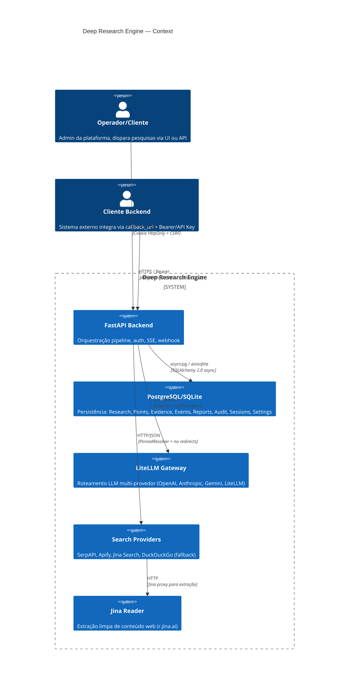
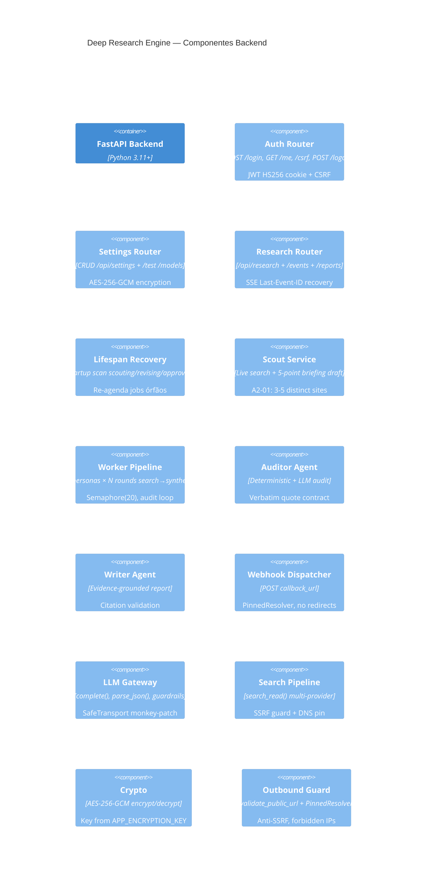

# Arquitetura — Deep Research Engine

> Architect — consolidação de 6 módulos + princípios + contracts  
> Doc level: Completo (C4 Context/Container/Component, ERD, ADRs, OpenAPI, traceability)  
> Última regeneração: 2026-10-05 (ciclo autônomo)

---

## 1. C4 Context Diagram



## 2. C4 Container Diagram

```mermaid
C4Container
title Deep Research Engine — Containers
Container(frontend, "React SPA", "TypeScript, Vite, React Router, Tailwind", "UI monolítica (main.tsx 2.5k LOC)")
Container(backend, "FastAPI Backend", "Python 3.11+, Uvicorn, SQLAlchemy 2.0 async", "Auth, Research pipeline, SSE, Webhook, Settings")
ContainerDb(db, "PostgreSQL / SQLite", "asyncpg / aiosqlite", "8 tabelas")
ContainerExt(llm_gateway, "LiteLLM Gateway", "litellm.acompletion", "Roteamento multi-provedor, SafeTransport (no redirects)")
ContainerExt(search_providers, "Search Providers", "SerpAPI, Apify, Jina, DuckDuckGo", "Busca web multi-provedor com failover")
ContainerExt(jina_reader, "Jina AI Reader", "r.jina.ai", "Extração markdown limpa de páginas web")
```

## 3. C4 Component Diagram (Backend)



## 4. Topologia & Fluxo

### 4.1 Stack
- **Backend**: Python 3.11+, FastAPI, SQLAlchemy 2.0 async (asyncpg/aiosqlite), LiteLLM, aiohttp, cryptography.
- **Frontend**: React + Vite + TypeScript, React Router, Tailwind, IndexedDB cache.
- **DB**: PostgreSQL (prod) / SQLite (dev/testes).
- **Migrations**: Alembic (0001 → 0002 → 0003).

### 4.2 Fluxo de vida da pesquisa
```
POST /api/research
  → Research(status=scouting)
  → run_scout: search_read → 3+ sites distintos → LLM briefing 5 pontos
  → status=pending_approval, SSE briefing_ready
  → POST /briefing/approve (ou /briefing/edit → revising → auto-approve)
  → status=approved, cria ResearchPoints, run_research
  → batches topológicos: run_point (4 personas em paralelo, Semaphore 20)
     cada point: busca iterativa ≤3 → síntese JSON → evidências
     auditor determinístico (verbatim) + LLM → approved/blocked
     até 3 tentativas; blocked → ponto não entra no relatório
  → run_writer: report markdown com citations (1:1 claim:quote:url, URL única por evidence)
  → status=completed → dispatch_callback (webhook)
  → callback falhou → completed_but_callback_failed (retry manual)
```

### 4.3 Estado de retomada
Lifespan no startup: `scouting` → re-agenda scout; `revising` → re-agenda revision; `approved/in_progress` → marca `interrupted` para retomada via endpoint (feature: resume).

## 5. Contratos
- **HTTP**: ver OpenAPI summary (§7).
- **SSE**: `text/event-stream`, eventos `briefing_ready`, `point_started`, `evidence_collected`, `audit_passed`, `report_ready`, `callback_delivered`; `Last-Event-ID` para re-sincronização; poll fallback 5s.
- **Worker result**: `evidence_schema` JSON (intent, evidence_completeness, evidence[], key_claims[], uncertainties[], contradictions[], missing_research[]).
- **Verbatim contract**: `exact_quote` substring exata (casefold) de `excerpt`; fonte truncada em 8000 chars (🔴 LACUNA 3).

## 6. ERD
Ver `domain.md` §entidades (8 tabelas). Relacionamentos:
```
research 1──* research_points
research_points 1──* evidences  (uq: point+persona+source_url)
research 1──1 reports
research 1──* agent_event_logs
research 1──* audit_trails
```

## 7. OpenAPI Summary (endpoints principais)

| Método | Path | Auth | Descrição |
|--------|------|------|-----------|
| POST | `/api/auth/login` | — | Login admin, set cookie |
| GET | `/api/auth/me` | Cookie/Bearer/API Key | Sessão atual |
| GET | `/api/auth/csrf` | Cookie | Refresh CSRF |
| POST | `/api/auth/logout` | Cookie | Revoga sessão |
| GET/PUT | `/api/settings` | Admin | Config mascarada / atualização |
| POST | `/api/settings/test` | Admin | Testa provider key |
| POST | `/api/settings/models` | Admin | Discovery modelos |
| GET | `/api/settings/models` | Admin | Catálogo dinâmico |
| POST | `/api/research` | Admin/Bearer | Cria pesquisa |
| GET | `/api/research` | Admin | Lista (100) |
| GET | `/api/research/{id}` | Admin | Status detalhado |
| POST | `/api/research/{id}/briefing/edit` | Admin | Edita → revising |
| POST | `/api/research/{id}/briefing/approve` | Admin | Aprova → run |
| GET | `/api/research/{id}/events` | Admin | Eventos (polling) |
| GET | `/api/research/{id}/events/stream` | Admin | SSE + Last-Event-ID |
| GET | `/api/reports/{id}` | Admin | Relatório |
| POST | `/api/reports/{id}/retry-callback` | Admin | Reenvia webhook |

## 8. ADRs

### ADR-001: JWT-in-cookie + CSRF separation
JWT HS256 cookie HttpOnly (`dr_session`), `jti` hashado em DB (revogável). CSRF em header separado. Bearer/API Key alternativos para B2B (mesmo segredo `API_AUTH_SECRET`). Credencial única por request (A-05).

### ADR-002: SSRF Defence em profundidade (fail-closed)
`validate_public_url` (DNS resolve → IP público) → `PinnedResolver` (anti-rebinding) → `allow_redirects=False` em todo client aiohttp → LiteLLM `SafeTransport` monkey-patch (`follow_redirects=False`). `TRUSTED_ROUTER_HOSTS` allowlist admin-only. `is_forbidden_ip`: loopback/link-local/multicast/reserved + cloud metadata (169.254.169.254 etc).

### ADR-003: Citação Verbatim como contract
`Evidence.excerpt` substring exata da fonte. Auditor determinístico: `claim.casefold() in exact_quote.casefold()`. LLM só aprova com todas claims essenciais verbatim. Risco: truncamento 8000 chars (LACUNA 3).

### ADR-004: Pipeline 4-personas + Auditor + Writer
Personas fixas (historian/skeptic/pragmatist/futurist). `Semaphore(20)`, 3 tentativas, batches topológicos por dependência (MA-01: paralelo + 1 sequencial por batch).

### ADR-005: Estado `revising` runtime-only
Status usado em fluxo de revisão mas ausente do enum Python; coluna `String(32)` sem constraint DB. 🔴 LACUNA — decidir inclusão no enum.

### ADR-006: Multi-provider Search Failover
SerpAPI → Apify → Jina Search → DuckDuckGo (Jina proxy HTML, fallback POST direto). Todos com `PinnedResolver`, `trust_env=False`, no redirects.

### ADR-007: AES-256-GCM para secrets
Key de `APP_ENCRYPTION_KEY` (base64 32B ou SHA-256 fallback), AAD fixo. Chaves encriptadas em `app_settings.encrypted_credentials`; GET retorna mascaradas; força re-entrada quando `re-entry_required`.

## 9. Matriz de Rastreabilidade (Critério → Código → Evidência)

| Critério | Descrição | Código Principal | Verificação |
|----------|-----------|------------------|-------------|
| A-01 | 3–5 fontes legíveis de sites distintos | `services/research.py:scout/_scout_impl` (site_map) | A-01 no prompt de seleção; filtro runtime |
| A-02 | Sanitização de outputs | `sanitize_error`, `sanitize_audit_dict` | Regex `sk|gsk|ghp|gho` + bearer patterns |
| A-03 | Isolamento de conteúdo untrusted | prompts `<untrusted_search_results>` | Base de prompts em `llm.py` |
| A-04 | Proibição `x-tenant-id` | `security.py:32-34` + frontend `api.ts` `headers.delete` | Test `test_auth_cookie_csrf_and_logout` |
| A-05 | Credencial única | `security.py:41-47` (400 ambiguous) | Test dedicated |
| F1–F3 | Settings: keys, models, callback | `services/settings.py` | `test_settings_are_encrypted_and_masked` |
| D | SSRF guard em outbound | `tools/outbound.py` | Test dedicated (loopback/priv/metadata) |
| MA-01 | Batch paralelo + 1 sequencial | `ready_point_batches` | Lógica topológica |
| MA-02 | max_tokens explorer | `llm.py:complete` | — |
| MA-03 | Models from settings | `runtime_settings` | Fallback ENV→DB |
| MA-05 | Callback global admin | `app_settings.callback_url` + `retry-callback` | Flow no router |
| MA-06 | Autor civil em pt-BR | prompt writer (auditor L) | Regra no prompt |
| MA-07 | Normalização títulos | prompt writer (auditor G2) | Rule check |
| MA-08 | Auditor retry concreto | `audit.py:next_audit_state` | Specific retry instructions |
| MA-09 | Workers miram personas | `llm.py:WORKER_BASE_PROMPT` | Composição de prompt |
| MA-10 | Verificação citação report | `run_writer` validation pass | Rejita report sem `URL/claim/quote` |

## 10. Débito Técnico

| Componente | LOC | Problema | Plano |
|------------|-----|----------|-------|
| `services/research.py` | 591 | Orquestrador monolítico | T010: < 200 LOC + workers |
| `frontend/main.tsx` | 2546 | UI monolítica | T005: componentes feature |
| `tests/test_backend.py` | 2226 | Mistura unit+integration | T011: separar |
| `tools/search_pipeline.py` | 227 | Alvo de migração | T001: `services/search.py` |
| `prompts/__init__.py` | 0 | Dead code | LACUNA 2 |
