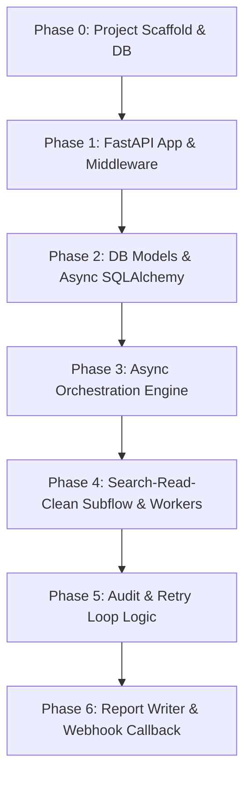

# Deep Research Engine - Plan

## ASCII Architecture Diagram

```
                    ┌──────────────────────────────────────────┐
                    │             External Caller              │
                    │   (POST /api/research, Bearer Auth)      │
                    └────────────────────────────┬─────────────┘
                                                  │
                                                  ▼
                    ┌──────────────────────────────────────────┐
                    │  FastAPI Application (app/main.py)      │
                    │  - Router Engine (Goal: /api/*)           │
                    │  - Security & Schema Middleware           │
                    └──────┬─────────────────────────────────┬┘
                       (Validação)                (Guardrails)
                        Error 400/401/422
                         Abort Here
                         ┌────┴────┐
                         ▼         ▼
 ┌─────────────────────┐        ┌──────────────────────────┐
 │  Async Orchestrator │        │  Settings (Pydantic Env) │
 │  (app/engine/)      │◄──────►│ - API Keys              │
 │  - Task Queue        │        │ - DB URI                 │
 │  - Parallel Executor │        │ - Auth Secret            │
 └──────┬─────────────▲┘        └─────────────▲──────────┘
        │             │                       │
        │ (Dispatch)  │   (Retry Loop)        │
        │             │                       │
        ▼             │                       │
 ┌────────────┐      │                       │
 │ Worker Pool│      │                       │
 │ (1 Histori- │      │                       │
 │ an,          │      │                       │
 │ 1 Skeptic,   │      │                       │
 │ 1 Pragmat.,  │      │                       │
 │ 1 FuturIST) │      │                       │
 └─────┬──────┘      │                       │
       │ (Unified Subflow)                  │
       ▼                                   │
 ┌─────────────────────────────────┐       │
 │ Search-Read-Clean Subflow        │     │
 │ - SerpAPI/Apify/Jina Scraper      │     │
 │ - Jina Reader (5-10 Reads)       │     │
 │ - Cleanup & Fusion Func          │     │
 └────────────┬─────────────────────┘       │
              │ (Evidence Stream)         │
              ▼                             │
 ┌─────────────────────────────────┐       │
 │  Async SQLAlchemy (PostgreSQL)  │◄──────┘
 │  - Research, Points, Workers,   │
 │  - Evidences (JSONB), Reports   │
 └─────────────────────────────────┘
              ▲
              │ (Audit Trigger)
              │
 ┌────────────┴─────────────────────┐
 │  Auditor (Juiz - Stateless)     │
 │  - Fact Check                    │
 │  - Contradiction Mapping         │
 │  - Outline Generator             │
 │  - Loop (Max 3 Attempts)        │
 └──────┬───────────────────────────┘
        │ (Decision: Approve/Retry/Blocker)
        ▼
 ┌─────────────────────────────────┐
 │ Redator (Final Writer)            │
 │  - Markdown Synthesis            │
 │  - No Tools                      │
 └──────┬───────────────────────────┘
        │ (Report Persistido no DB)
        ▼
 ┌─────────────────────────────────┐
 │ Webhook Callback Service          │
 │  (POST callback_url)            │
 └─────────────────────────────────┘
```

## Sequence Diagram (Tenant Connects / Data Flows In)

1. **Chamada Externa:** Request ingressa pelo `POST /api/research` com `Authorization: Bearer <token>`.
2. **Middleware:** Valida schema (tema não vazio, callback URL bem formada, token correto). Rejeita com `422` / `401` se inválido.
3. **Router Engine:** Dispara a tarefa orquestral assíncrona.
4. **Briefing & Scout:** (Mockado nesta fase) Gera rascunho de 5 pontos e persiste estado.
5. **Orquestrador:** Lê pontos; cria jobs no pool de workers.
6. **Workers (x4/persona):** Cada worker chama o subfluxo `Search-Read-Clean` em paralelo.
7. **Subfluxo:** Consulta via SerpAPI/Apify/Jina → Lê conteúdo via Jina Reader → Limpa e une resultados brutos → retorna para o worker.
8. **Persistência de Evidências:** Worker grava evidências no DB com *Optimistic Locking* por `research_point_id`.
9. **Auditor:** Após todos os workers do ponto concluírem, roda logicamente. Decide aprovação/retenta/bloqueio.
10. **Redator:** Ao fim de todos os pontos, compila relatório final.
11. **Callback:** Envia relatório para `callback_url` registrada na submissão original.

## New Data Models (SQLAlchemy)

### `Research` (Tabela: `research`)
| Coluna | Tipo | Restrições |
|--------|------|------------|
| `id` | UUID | PK, default `uuid4()` |
| `theme` | String | NOT NULL |
| `callback_url` | String(2048) | NOT NULL |
| `status` | Enum | `draft`, `approved`, `in_progress`, `completed`, `blocked` |
| `briefing_draft` | JSONB | NOT NULL |
| `created_at`, `updated_at` | DateTime | timestamps |

### `ResearchPoint` (Tabela: `research_points`)
| Coluna | Tipo | Restrições |
|--------|------|------------|
| `id` | UUID | PK |
| `research_id` | UUID | FK `research.id` |
| `title`, `description` | String | NOT NULL |
| `dependencies` | JSONB | array de UUIDs de outros pontos |
| `is_parallelizable` | Boolean | default True |
| `attempt_count` | Integer | default 0 |

### `EvidenceRecord` (Tabela: `evidences`)
| Coluna | Tipo | Restrições |
|--------|------|------------|
| `id` | UUID | PK |
| `research_point_id` | UUID | FK |
| `worker_persona` | Enum | `historian`, `skeptic`, `pragmatist`, `futurist` |
| `source_url`, `content` | String / Text | NOT NULL |
| `cleaned_summary` | Text | |
| `metadata` | JSONB | extra (autor, data, scores) |
| `version` | Integer | Para controle de *Optimistic Locking* |

### `AuditTrail` (Tabela: `audit_trails`)
| Coluna | Tipo | Restrições |
|--------|------|------------|
| `id` | UUID | PK |
| `research_point_id` | UUID | FK |
| `finding_type` | Enum | `approved`, `retry_required`, `blocked` |
| `rationale`, `findings_json` | Text, JSONB | NOT NULL |
| `decision_made_at` | DateTime | timestamp |

### `Report` (Tabela: `reports`)
| Coluna | Tipo | Restrições |
|--------|------|------------|
| `id` | UUID | PK |
| `research_id` | UUID | FK UNIQUE |
| `content_markdown` | Text | NOT NULL |
| `outline_used` | JSONB | copia do outline do auditor |
| `generated_at`, `callback_dispatched_at` | DateTime | timestamps |

## Mapping Tables

Não há formatos externos complexos nesta fase — a integração é interna (workers → auditores → redator), todos usando os mesmos modelos SQLAlchemy acima.

## Phases With Dependency Order



### Phase Breakdown

1. **Phase 0 - Scaffold & DB:** Inicializa estrutura de pastas (`app/`, `app/api/`, `app/engine/`, `app/tools/`, `app/models/`), instala dependências (`requirements.txt`) e cria migration base com Alembic.

2. **Phase 1 - FastAPI App & Middleware:** Cria app principal, define roteador `/api/research` e `/api/reports/{id}`, implementa middleware de validação de schema e Bearer Token Auth.

3. **Phase 2 - DB Models:** Implementa os 5 modelos SQLAlchemy (`Research`, `ResearchPoint`, `EvidenceRecord`, `AuditTrail`, `Report`) com `AsyncSession` e *Optimistic Locking* via coluna `version`.

4. **Phase 3 - Async Engine:** Cria o `Orchestrator` assíncrono responsável por ler pontos, disparar workers em paralelo e controlar o loop de auditoria/retry.

5. **Phase 4 - Workers & Subflow:** Implementa o pool de 4 workers (personas) e o subfluxo de coleta (`Search-Read-Clean`) usando `SerpAPI`/`Jina`/`Apify` via `httpx` assíncrono.

6. **Phase 5 - Auditor Logic:** Implementa lógica pura de auditoria (fact-check, mapeamento de contradições, criação de outline) e loop de retenção de 3 tentativas com *blocker*.

7. **Phase 6 - Redator & Webhooks:** Implementa o gerador de relatórios em Markdown e o dispatch assíncrono de POST para `callback_url`.
