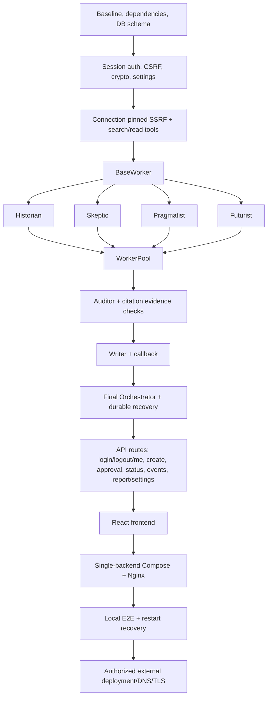

# Deep Research Engine - Canonical Architecture & System Plan

## 1. System Architecture Overview & ASCII Diagram

The Deep Research Engine is structured as a full-stack multi-agent system. Local Docker Compose runs PostgreSQL, exactly one FastAPI backend process/replica (until a database lease or distributed queue exists), and an Nginx-hosted frontend. Traefik/Coolify ingress at `research.dominuslabs.online` is a deployment target, not assumed current infrastructure; public DNS/TLS configuration requires real access and separate authorization.

```
                                  HTTPS Request
                                        │
                                        ▼
    ┌────────────────────────────────────────────────────────────────────────┐
    │  Optional authorized Traefik/Coolify ingress (target domain + TLS)       │
    └───────────────────┬────────────────────────────────┬───────────────────┘
                        │ /                              │ /api/*
                        ▼                                ▼
    ┌──────────────────────────────────────┐  ┌──────────────────────────────────────┐
    │ Frontend Container (Nginx)           │  │ Backend Container (FastAPI, Python)  │
    │ - React 19 + TanStack Router         │  │ - Router & Schema Middleware         │
    │ - Tailwind CSS (Linear Dark Tokens)  │  │ - Session Auth + CSRF / SSRF         │
    │ - Zustand State Management           │  │ - Dynamic Provider & Model Registry  │
    │ - Real-Time SSE Stream Consumer      │  │ - Async Multi-Agent Orchestrator     │
    └──────────────────────────────────────┘  └──────────────────┬───────────────────┘
                                                                 │
                   ┌─────────────────────────────────────────────┼────────────────────────────────────────────┐
                   ▼                                             ▼                                            ▼
    ┌─────────────────────────────┐               ┌─────────────────────────────┐              ┌─────────────────────────────┐
    │ Cognitive Pipeline Engine   │               │ Tool & Web Scraping Layer   │              │ Database Layer (PostgreSQL) │
    │ 1. Scout Agent (LLM)        │               │ - Connection-pinned SSRF Guard     │              │ - Async SQLAlchemy + pg     │
    │ 2. Human Briefing Review    │               │ - SerpAPI / Apify / Jina    │              │ - Server-scoped Admin Data   │
    │ 3. WorkerPool (20 Max Cap)  │──────────────►│ - Jina Reader (HTML Clean)  │─────────────►│ - Optimistic Locking        │
    │    [Hist, Skep, Prag, Fut]  │               │ - Content Fusion Normalizer │              │ - Encrypted Settings Store  │
    │ 4. Fact-Checking Auditor    │               │ - Webhook Callback Client   │              │ - Alembic Migrations        │
    │ 5. Report Markdown Writer   │               └─────────────────────────────┘              └─────────────────────────────┘
    └─────────────────────────────┘
```

---

## 2. Detailed Sequence Diagrams

### Flow 0: Secure Session Login & Logout

```text
Operator Browser              FastAPI Auth Router            Session Store / Cookie
     │                               │                              │
     │ 1. POST /api/auth/login       │                              │
     │    {password} + CSRF origin   │                              │
     ├──────────────────────────────►│                              │
     │                               │ 2. Verify ADMIN_PASSWORD     │
     │                               │ 3. Issue signed session      │
     │                               ├─────────────────────────────►│
     │ 4. Set-Cookie: HttpOnly,      │                              │
     │    Secure(prod), SameSite     │                              │
     │◄──────────────────────────────┤                              │
     │ 5. POST /api/auth/logout      │                              │
     ├──────────────────────────────►│ 6. Revoke + clear cookie     │
     │◄──────────────────────────────┤                              │
```

Browser JavaScript never receives `API_AUTH_SECRET`, provider credentials, or session signing material. Direct API clients may use a server-managed Bearer token; this does not create a tenant identity.

### Flow 1: Research Submission, Scout Exploration & Brief Pause

```
Operator/User                 FastAPI Ingress               Scout Agent (LLM)           Database (PostgreSQL)
     │                               │                              │                            │
     │ 1. POST /api/research         │                              │                            │
     │    {theme, callback_url}      │                              │                            │
     ├──────────────────────────────►│                              │                            │
     │                               │ 2. Validate Session + CSRF   │                            │
     │                               │ 3. Validate callback socket │                            │
     │                               │    policy; INSERT DRAFT      │                            │
     │                               ├──────────────────────────────────────────────────────────►│
     │ 4. 201 Created {research_id}  │                              │                            │
     │◄──────────────────────────────┤                              │                            │
     │                               │ 5. Commit durable SCOUTING   │                            │
     │                               │ 6. Claim idempotent job      │                            │
     │                               ├─────────────────────────────►│                            │
     │                               │                              │ 6. Search & Explore Web    │
     │                               │                              │ 7. Generate 5-Point Brief  │
     │                               │ 8. Save Briefing Draft       │                            │
     │                               │    Status -> PENDING_APPROVAL│                            │
     │                               │◄─────────────────────────────┤                            │
     │                               │ 9. UPDATE Research           │                            │
     │                               ├──────────────────────────────────────────────────────────►│
     │                               │ 10. Emit SSE: "brief_ready"  │                            │
     │◄──────────────────────────────┴──────────────────────────────┴────────────────────────────┤
```

### Flow 2: Human-in-the-Loop Brief Review & Parallel Dispatch

```
Operator/User                 FastAPI Ingress               Orchestrator                Worker Pool (20 Max)
     │                               │                              │                            │
     │ 1. POST /api/research/{id}/   │                              │                            │
     │    briefing/approve {points}  │                              │                            │
     ├──────────────────────────────►│                              │                            │
     │                               │ 2. Save Approved Points      │                            │
     │                               │    Status -> IN_PROGRESS     │                            │
     │ 3. 200 OK {status: approved}  │                              │                            │
     │◄──────────────────────────────┤ 4. Dispatch Parallel Exec    │                            │
     │                               ├─────────────────────────────►│                            │
     │                               │                              │ 5. Acquire Semaphore(20)   │
     │                               │                              │ 6. Spawn 4 Personas/Point  │
     │                               │                              ├───────────────────────────►│
```

### Flow 3: Worker Execution, Search-Read-Clean & Live Process Streaming

```
Worker (Persona)             Search-Read-Clean Tool         PostgreSQL (Evidences)       SSE Stream (Frontend)
     │                               │                            │                               │
     │ 1. Refine Query by Persona    │                            │                               │
     │ 2. Call search(query)         │                            │                               │
     ├──────────────────────────────►│                            │                               │
     │                               │ 3. Query SerpAPI/Apify/Jina│                               │
     │                               │ 4. Fetch 5-10 URLs         │                               │
     │                               │    via Jina Reader (SSRF-v)│                               │
     │                               │ 5. Clean & Fuse Content    │                               │
     │ 6. Return Consolidated Text   │                            │                               │
     │◄──────────────────────────────┤                            │                               │
     │ 7. Real LLM Synthesis         │                            │                               │
     │    (Summarize findings)       │                            │                               │
     │ 8. INSERT EvidenceRecord      │                            │                               │
     │    (Optimistic Lock version)  │                            │                               │
     ├───────────────────────────────────────────────────────────►│                               │
     │ 9. Emit Public Status Event   │                            │                               │
     │    generated separately; raw  │                            │                               │
     │    LLM stream never enters SSE│                            │                               │
     ├───────────────────────────────────────────────────────────────────────────────────────────►│
```

### Flow 4: Point Audit Loop & Blocker Escalation

```
Orchestrator                  Auditor (Stateless Judge)      Database (AuditTrail)       Worker Pool
     │                               │                            │                           │
     │ 1. All 4 Personas Complete    │                            │                           │
     ├──────────────────────────────►│                            │                           │
     │                               │ 2. Validate Completeness   │                           │
     │                               │ 3. Map claims to extracted│                           │
     │                               │    evidence text + URLs    │                           │
     │                               │    and score uncertainty  │                           │
     │                               │ 4. Detect Contradictions   │                           │
     │                               │ 5. Build Section Outline   │                           │
     │                               │ 6. Record AuditTrail       │                           │
     │                               ├───────────────────────────►│                           │
     │                               │                            │                           │
     │  [Case A: Approved]           │                            │                           │
     │◄──────────────────────────────┤ (approved=True, outline)   │                           │
     │                               │                            │                           │
     │  [Case B: Retry (< 3 att)]    │                            │                           │
     │◄──────────────────────────────┤ (approved=False, retry)    │                           │
     │ 7. Trigger Targeted Re-search │                            │                           │
     ├───────────────────────────────────────────────────────────────────────────────────────►│
     │                               │                            │                           │
     │  [Case C: Blocker (= 3 att)]  │                            │                           │
     │◄──────────────────────────────┤ (approved=False, blocker)  │                           │
     │ 8. Flag Point as BLOCKED      │                            │                           │
     │    Forward Caveats to Writer  │                            │                           │
```

### Flow 5: Report Synthesis & SSRF-Protected Webhook Dispatch

```
Orchestrator                  Writer Agent (LLM)            PostgreSQL (Reports)        External Webhook
     │                               │                            │                            │
     │ 1. Compile All Point Outlines │                            │                            │
     ├─────────────────────────────►│                            │                            │
     │                               │ 2. Synthesize Markdown     │                            │
     │                               │    (Strictly from Evidence)│                            │
     │ 3. Return Final Markdown      │                            │                            │
     │◄─────────────────────────────┤                            │                            │
     │ 4. INSERT Report Record       │                            │                            │
     │    Status -> COMPLETED        │                            │                            │
     ├───────────────────────────────────────────────────────────►│                            │
     │ 5. Emit SSE: "report_ready"   │                            │                            │
     │ 6. Resolve + validate callback│                            │                            │
     │    at connection time; pin IP │                            │                            │
     │    and revalidate redirects   │                            │                            │
     │ 7. POST callback_url          │                            │                            │
     │    {research_id, report_md}   │                            │                            │
     ├────────────────────────────────────────────────────────────────────────────────────────►│
```

### Flow 6: Encrypted Settings Persistence & Dynamic Model Hot-Reload

```
Operator UI                   FastAPI (/api/settings)       PostgreSQL (app_settings)    LLM Provider Registry
     │                               │                            │                               │
     │ 1. PUT /api/settings          │                            │                               │
     │    {keys, model_mappings}     │                            │                               │
     ├──────────────────────────────►│                            │                               │
     │                               │ 2. Encrypt Secrets via     │                               │
     │                               │    AES-256-GCM             │                               │
     │                               │ 3. UPSERT app_settings     │                               │
     │                               ├───────────────────────────►│                               │
     │                               │ 4. Hot-reload In-Memory    │                               │
     │                               │    Provider Cache          │                               │
     │                               ├───────────────────────────────────────────────────────────►│
     │ 5. 200 OK (Masked Secrets)    │                            │                               │
     │◄──────────────────────────────┤                            │                               │
```

---

## 3. Complete Data Models (SQLAlchemy Declarative Async)

All models include explicit type annotations, foreign key constraints, indexes, and a server-assigned `tenant_id="default"` compatibility field. This field is never derived from browser headers; single-admin authentication is the active identity model.

```python
# app/models/domain_models.py (Specification)

class ResearchStatus(str, PyEnum):
    DRAFT = "draft"
    SCOUTING = "scouting"
    PENDING_APPROVAL = "pending_approval"
    APPROVED = "approved"
    IN_PROGRESS = "in_progress"
    COMPLETED = "completed"
    BLOCKED = "blocked"
    COMPLETED_BUT_CALLBACK_FAILED = "completed_but_callback_failed"
    INTERRUPTED = "interrupted"

class WorkerPersona(str, PyEnum):
    HISTORIAN = "historian"
    SKEPTIC = "skeptic"
    PRAGMATIST = "pragmatist"
    FUTURIST = "futurist"

class FindingType(str, PyEnum):
    APPROVED = "approved"
    RETRY_REQUIRED = "retry_required"
    BLOCKED = "blocked"

class PointStatus(str, PyEnum):
    PENDING = "pending"
    RUNNING = "running"
    AUDITING = "auditing"
    APPROVED = "approved"
    RETRYING = "retrying"
    BLOCKED = "blocked"

# 1. Research Root Entity
class Research(Base):
    __tablename__ = "research"
    id: Column[uuid.UUID] = Column(UUID(as_uuid=True), primary_key=True, default=uuid.uuid4)
    tenant_id: Column[str] = Column(String(64), nullable=False, default="default", index=True)
    theme: Column[str] = Column(String(500), nullable=False)
    callback_url: Column[str] = Column(String(2048), nullable=True)
    status: Column[ResearchStatus] = Column(Enum(ResearchStatus), default=ResearchStatus.DRAFT, nullable=False, index=True)
    job_claimed_at: Column[datetime] = Column(DateTime(timezone=True), nullable=True)
    job_heartbeat_at: Column[datetime] = Column(DateTime(timezone=True), nullable=True)
    resume_from_stage: Column[str] = Column(String(64), nullable=True)
    briefing_draft: Column[dict] = Column(JSONB, nullable=False, default=dict)
    created_at: Column[datetime] = Column(DateTime(timezone=True), default=datetime.utcnow, nullable=False)
    updated_at: Column[datetime] = Column(DateTime(timezone=True), default=datetime.utcnow, onupdate=datetime.utcnow, nullable=False)

    points = relationship("ResearchPoint", back_populates="research", cascade="all, delete-orphan")
    reports = relationship("Report", uselist=False, back_populates="research", cascade="all, delete-orphan")
    event_logs = relationship("AgentEventLog", back_populates="research", cascade="all, delete-orphan")

# 2. Research Investigation Point
class ResearchPoint(Base):
    __tablename__ = "research_points"
    id: Column[uuid.UUID] = Column(UUID(as_uuid=True), primary_key=True, default=uuid.uuid4)
    tenant_id: Column[str] = Column(String(64), nullable=False, default="default", index=True)
    research_id: Column[uuid.UUID] = Column(UUID(as_uuid=True), ForeignKey("research.id", ondelete="CASCADE"), nullable=False, index=True)
    point_index: Column[int] = Column(Integer, nullable=False)
    title: Column[str] = Column(String(255), nullable=False)
    description: Column[str] = Column(Text, nullable=True)
    dependencies: Column[list] = Column(JSONB, default=list, nullable=False)
    is_parallelizable: Column[bool] = Column(Boolean, default=True, nullable=False)
    status: Column[PointStatus] = Column(Enum(PointStatus), default=PointStatus.PENDING, nullable=False)
    attempt_count: Column[int] = Column(Integer, default=0, nullable=False)
    max_attempts: Column[int] = Column(Integer, default=3, nullable=False)
    created_at: Column[datetime] = Column(DateTime(timezone=True), default=datetime.utcnow, nullable=False)

    research = relationship("Research", back_populates="points")
    evidences = relationship("EvidenceRecord", back_populates="point", cascade="all, delete-orphan")
    audits = relationship("AuditTrail", back_populates="point", cascade="all, delete-orphan")

# 3. Collected Evidence Record (Optimistic Locking)
class EvidenceRecord(Base):
    __tablename__ = "evidences"
    id: Column[uuid.UUID] = Column(UUID(as_uuid=True), primary_key=True, default=uuid.uuid4)
    tenant_id: Column[str] = Column(String(64), nullable=False, default="default", index=True)
    research_point_id: Column[uuid.UUID] = Column(UUID(as_uuid=True), ForeignKey("research_points.id", ondelete="CASCADE"), nullable=False, index=True)
    worker_persona: Column[WorkerPersona] = Column(Enum(WorkerPersona), nullable=False, index=True)
    source_url: Column[Text] = Column(Text, nullable=False)
    content: Column[str] = Column(Text, nullable=False)
    cleaned_summary: Column[str] = Column(Text, nullable=True)
    metadata_: Column[dict] = Column(JSONB, default=dict, nullable=False)
    version: Column[int] = Column(Integer, default=1, nullable=False)  # Optimistic Locking
    created_at: Column[datetime] = Column(DateTime(timezone=True), default=datetime.utcnow, nullable=False)

    point = relationship("ResearchPoint", back_populates="evidences")

# 4. Audit Trail & Verification Decision
class AuditTrail(Base):
    __tablename__ = "audit_trails"
    id: Column[uuid.UUID] = Column(UUID(as_uuid=True), primary_key=True, default=uuid.uuid4)
    tenant_id: Column[str] = Column(String(64), nullable=False, default="default", index=True)
    research_point_id: Column[uuid.UUID] = Column(UUID(as_uuid=True), ForeignKey("research_points.id", ondelete="CASCADE"), nullable=False, index=True)
    attempt_number: Column[int] = Column(Integer, nullable=False)
    finding_type: Column[FindingType] = Column(Enum(FindingType), nullable=False)
    rationale: Column[str] = Column(Text, nullable=False)
    findings_json: Column[dict] = Column(JSONB, default=dict, nullable=False)
    decision_made_at: Column[datetime] = Column(DateTime(timezone=True), default=datetime.utcnow, nullable=False)

    point = relationship("ResearchPoint", back_populates="audits")

# 5. Compiled Final Report
class Report(Base):
    __tablename__ = "reports"
    id: Column[uuid.UUID] = Column(UUID(as_uuid=True), primary_key=True, default=uuid.uuid4)
    tenant_id: Column[str] = Column(String(64), nullable=False, default="default", index=True)
    research_id: Column[uuid.UUID] = Column(UUID(as_uuid=True), ForeignKey("research.id", ondelete="CASCADE"), unique=True, nullable=False)
    content_markdown: Column[str] = Column(Text, nullable=False)
    outline_used: Column[dict] = Column(JSONB, default=dict, nullable=False)
    citation_stats: Column[dict] = Column(JSONB, default=dict, nullable=False)
    generated_at: Column[datetime] = Column(DateTime(timezone=True), default=datetime.utcnow, nullable=False)
    callback_dispatched_at: Column[datetime] = Column(DateTime(timezone=True), nullable=True)

    research = relationship("Research", back_populates="reports")

# 6. Encrypted Settings Store
class AppSettings(Base):
    __tablename__ = "app_settings"
    id: Column[uuid.UUID] = Column(UUID(as_uuid=True), primary_key=True, default=uuid.uuid4)
    tenant_id: Column[str] = Column(String(64), nullable=False, unique=True, index=True)
    encrypted_credentials: Column[Text] = Column(Text, nullable=False)  # AES-256-GCM ciphertext
    agent_model_mappings: Column[dict] = Column(JSONB, nullable=False, default=dict)
    version: Column[int] = Column(Integer, default=1, nullable=False)
    updated_at: Column[datetime] = Column(DateTime(timezone=True), default=datetime.utcnow, onupdate=datetime.utcnow, nullable=False)

# 7. Agent Operational Event Stream Log (explicit public events only)
class AgentEventLog(Base):
    __tablename__ = "agent_event_logs"
    id: Column[uuid.UUID] = Column(UUID(as_uuid=True), primary_key=True, default=uuid.uuid4)
    tenant_id: Column[str] = Column(String(64), nullable=False, default="default", index=True)
    research_id: Column[uuid.UUID] = Column(UUID(as_uuid=True), ForeignKey("research.id", ondelete="CASCADE"), nullable=False, index=True)
    point_id: Column[uuid.UUID] = Column(UUID(as_uuid=True), nullable=True)
    agent_name: Column[str] = Column(String(64), nullable=False)
    event_type: Column[str] = Column(String(64), nullable=False)
    summary_message: Column[str] = Column(Text, nullable=False)  # Explicitly generated public summary
    created_at: Column[datetime] = Column(DateTime(timezone=True), default=datetime.utcnow, nullable=False)

    research = relationship("Research", back_populates="event_logs")

# 8. Revocable server-side admin session (cookie contains only opaque ID)
class AdminSession(Base):
    __tablename__ = "admin_sessions"
    id_hash: Column[str] = Column(String(64), primary_key=True)
    csrf_hash: Column[str] = Column(String(64), nullable=False)
    expires_at: Column[datetime] = Column(DateTime(timezone=True), nullable=False, index=True)
    revoked_at: Column[datetime] = Column(DateTime(timezone=True), nullable=True)
    created_at: Column[datetime] = Column(DateTime(timezone=True), default=datetime.utcnow, nullable=False)
```

---

## 4. API Endpoints & Contract Schemas

All protected endpoints accept the secure HttpOnly admin session cookie issued by `/api/auth/login`; programmatic clients may use a server-managed Bearer token. `X-Tenant-ID` is rejected and never establishes identity. Browser mutations require valid CSRF proof.

### 0. Admin Authentication

- `POST /api/auth/login`
  - Request: `{ "password": "<admin bootstrap password>" }`
  - Response `200`: `{ "authenticated": true, "user": "admin" }`
  - Side effect: creates `admin_sessions` record containing only session-ID hash, expiry/revocation, and CSRF metadata; sets opaque `HttpOnly`, `SameSite=Lax` (or `Strict`), `Secure` in production session cookie; returns no secret material.
- `POST /api/auth/logout`
  - Requires session + CSRF; revokes session and expires cookie.
- `GET /api/auth/me`
  - Response `200`: `{ "authenticated": true, "user": "admin" }`; unauthenticated response is `401`.

### 1. Research Submission: `POST /api/research`
- **Authentication**: HttpOnly session + CSRF for browsers, or server-managed Bearer token for direct API clients. Client-supplied `X-Tenant-ID` is rejected.
- **Request Body**:
  ```json
  {
    "theme": "Impact of Quantum Computing on Post-Quantum Cryptography standards by 2030",
    "callback_url": "https://webhook.site/test-uuid"
  }
  ```
- **Validation**:
  - `theme`: string, min 3 chars, max 500 chars.
  - `callback_url`: valid HTTP/HTTPS URL; actual callback dispatch uses connection-time IP validation/pinning and per-hop redirect validation.
- **Response (201 Created)**:
  ```json
  {
    "research_id": "9b1deb4d-3b7d-4bad-9bdd-2b0d7b3dcb6d",
    "theme": "Impact of Quantum Computing...",
    "status": "scouting",
    "briefing_url": "/api/research/9b1deb4d-3b7d-4bad-9bdd-2b0d7b3dcb6d",
    "stream_url": "/api/research/9b1deb4d-3b7d-4bad-9bdd-2b0d7b3dcb6d/stream",
    "message": "Research initiated. Scout agent is generating the 5-point brief."
  }
  ```

### 2. Status & Brief Inspection: `GET /api/research/{id}`
- **Response (200 OK)**:
  ```json
  {
    "research_id": "9b1deb4d-3b7d-4bad-9bdd-2b0d7b3dcb6d",
    "theme": "Impact of Quantum Computing...",
    "status": "pending_approval",
    "briefing_draft": {
      "points": [
        {
          "point_index": 1,
          "title": "Theoretical Foundations of Shor's Algorithm and Threat Horizon",
          "description": "Examine mathematical consensus and qubit thresholds required to break RSA-2048.",
          "dependencies": [],
          "is_parallelizable": true
        }
      ]
    },
    "created_at": "2026-10-01T05:00:00Z",
    "updated_at": "2026-10-01T05:01:30Z"
  }
  ```

### 3. One-Time Brief Approval / Edit: `POST /api/research/{id}/briefing/approve`
- **Request Body**:
  ```json
  {
    "approved_points": [
      {
        "point_index": 1,
        "title": "Theoretical Foundations of Shor's Algorithm and Threat Horizon",
        "description": "Examine mathematical consensus and qubit thresholds required to break RSA-2048.",
        "dependencies": [],
        "is_parallelizable": true
      }
    ]
  }
  ```
- **Response (200 OK)**:
  ```json
  {
    "message": "Briefing approved. Parallel research workers dispatched.",
    "research_id": "9b1deb4d-3b7d-4bad-9bdd-2b0d7b3dcb6d",
    "status": "in_progress",
    "worker_count": 20
  }
  ```

### 4. Real-Time Process Stream: `GET /api/research/{id}/stream`
- **Protocol**: Server-Sent Events (`text/event-stream`).
- **Events**:
  - `event: progress`
    `data: {"agent": "scout", "type": "scouting_started", "message": "Analyzing theme across 8 seed queries", "timestamp": "2026-10-01T05:00:15Z"}`
  - `event: brief_ready`
    `data: {"status": "pending_approval", "message": "5-point investigative brief drafted"}`
  - `event: worker_progress`
    `data: {"point_index": 1, "persona": "skeptic", "type": "read_completed", "sources_read": 6, "summary": "Found 3 critical papers challenging qubit fault tolerance claims."}`
  - `event: audit_decision`
    `data: {"point_index": 1, "attempt": 1, "verdict": "approved", "rationale": "All 4 personas verified; no unresolved contradictions."}`
  - `event: report_ready`
    `data: {"status": "completed", "report_id": "uuid-here"}`

### 5. Final Report Retrieval: `GET /api/reports/{id}`
- **Response (200 OK)**:
  ```json
  {
    "report_id": "e4f2b1a8-9d8c-4f7e-a0e2-7c3d5a1b2c4e",
    "research_id": "9b1deb4d-3b7d-4bad-9bdd-2b0d7b3dcb6d",
    "theme": "Impact of Quantum Computing...",
    "content_markdown": "# Deep Research Report: Quantum Computing...",
    "citation_stats": {
      "total_sources_scanned": 42,
      "verified_citations": 28,
      "academic_papers": 14
    },
    "generated_at": "2026-10-01T05:15:00Z",
    "callback_dispatched": true
  }
  ```

### 6. Callback Manual Retry: `POST /api/reports/{id}/retry-callback`
- **Response (200 OK)**:
  ```json
  {
    "success": true,
    "dispatched_at": "2026-10-01T05:16:00Z",
    "status_code": 200
  }
  ```

### 7. Settings Inspection & Management: `GET /api/settings` and `PUT /api/settings`
- **GET Response (200 OK)** (Masked Credentials):
  ```json
  {
    "configured_providers": {
      "openai": true,
      "anthropic": true,
      "gemini": false,
      "serpapi": true,
      "apify": false,
      "jina": true
    },
    "agent_model_mappings": {
      "scout": "provider/current-scout-model",
      "historian": "provider/current-fast-model",
      "skeptic": "provider/current-reasoning-model",
      "pragmatist": "provider/current-fast-model",
      "futurist": "provider/current-long-context-model",
      "auditor": "provider/current-reasoning-model",
      "writer": "provider/current-writing-model"
    },
    "updated_at": "2026-10-01T04:50:00Z"
  }
  ```
- **PUT Request**:
  ```json
  {
    "provider_credentials": {
      "openai_api_key": "sk-proj-...",
      "anthropic_api_key": "sk-ant-..."
    },
    "agent_model_mappings": {
      "scout": "provider/current-scout-model",
      "historian": "provider/current-fast-model"
    }
  }
  ```

---

## 5. Security, Guardrails & Privacy Boundary

### 1. Authentication, Session & CSRF Architecture
- Single-admin identity. Server assigns internal context; client `X-Tenant-ID` is rejected and never used as identity.
- `POST /api/auth/login` verifies the bootstrap admin password and issues an opaque or signed session cookie with `HttpOnly`, `Secure` in production, and `SameSite=Lax` or stricter.
- Browser state-changing requests require CSRF validation (same-origin checks and/or double-submit token). `POST /api/auth/logout` revokes the server-side session and clears its cookie.
- `API_AUTH_SECRET`, provider keys, encryption keys, and session signing keys never enter browser JavaScript or frontend bundles.

### 2. SSRF Protection Architecture (`app/tools/ssrf_guard.py`)
All outgoing HTTP requests initiated by the application (webhook callbacks, Jina Reader targets, Apify requests, custom scrapers) must use one connection-pinned transport:
- **Connection-Time Enforcement**: Resolve hostname, reject every denied candidate, pin an approved IP to the actual connection, retain the original hostname for TLS SNI/certificate verification, and prevent a second uncontrolled DNS lookup. DNS pre-resolution alone is not sufficient because of rebinding/TOCTOU.
- **CIDR Denylist**: reject IPv4/IPv6 loopback, RFC1918, link-local, unique-local, multicast, unspecified, reserved, IPv4-mapped IPv6, and metadata endpoints including `169.254.169.254`.
- **Protocol Enforcement**: Only `http` and `https`; standard ports 80/443 unless explicitly allowlisted.
- **Redirect Guard**: Disable automatic redirects (`follow_redirects=False`) or repeat full parse, resolution, denylist, and connection pinning for every hop, with a strict hop limit.
- **Shared Enforcement**: Web readers and `callback_url` webhooks use the same transport and tests.

### 3. Privacy Boundary: Explicit Public Events
- Raw LLM completion streams are confined to agent execution and never enter `agent_event_logs`, SSE queues, logs, or API responses.
- Public status events are separately constructed from a strict schema/allowlist (`agent`, `event_type`, state, source counts, public summary). A post-generation sanitizer is defense-in-depth only; stripping `<thought>` tags is not the privacy boundary.
- Event examples: `scout_started`, `sources_scanned`, `worker_completed`, `audit_verdict`, `report_ready`.

### 4. Encrypted Settings, Bootstrap & Precedence
- **Encryption Algorithm**: AES-256-GCM authenticated encryption using `APP_ENCRYPTION_KEY` loaded from environment.
- **First Run**: Generate only local secrets (`APP_ENCRYPTION_KEY`, `SESSION_SECRET`, database password) when missing. Preserve any existing `.env`. Never fabricate or auto-insert unavailable provider credentials.
- **External Credentials**: Operator enters provider keys in secure Settings UI after login, or supplies them through an explicit secure environment configuration.
- **Precedence Hierarchy**: encrypted DB settings for the server-assigned admin context, then environment defaults.
- **Hot-Reload**: `LLMProviderRegistry` invalidates and re-instantiates cached clients immediately after `PUT /api/settings`.

---

## 6. Concurrency, Durability & Worker Lifecycle

1. **Concurrency Semaphore**:
   - `asyncio.Semaphore(20)` enforces a strict ceiling of 20 concurrent worker executions in the single backend instance.
   - For a standard 5-point research with 4 personas per point, up to 20 workers execute in parallel when unconstrained by point dependencies.
2. **Durable State & Restart Recovery**:
   - Before dispatching work, commit the durable research/point state and stage marker. After each worker, audit, and writer milestone, commit evidence, attempt counters, and status transactionally.
   - Startup recovery scans stale `SCOUTING`/`IN_PROGRESS` jobs. It uses idempotency keys plus `job_claimed_at`/`job_heartbeat_at` to resume the next incomplete stage or mark `INTERRUPTED` with a recoverable error. An orphaned `asyncio.Task` is never considered durable state.
   - Docker Compose runs exactly one backend process and replica. Add multiple replicas only after implementing an atomic database lease or distributed queue.
3. **Optimistic Locking**:
   - Every `EvidenceRecord` write checks the current `version`.
   - If concurrent modifications occur on the same point, the session aborts and retries with bounded jittered backoff.
4. **Audit Retry & Blocker Loop**:
   - Max 3 attempts per point.
   - Failure condition: missing persona evidence, claims without matching extracted support, material unresolved contradictions, or insufficient confidence.
   - On the third failure, persist `BLOCKED`, explicit caveats, uncertainty, and unresolved claims; then pass those caveats to the Writer.
5. **Citation Quality Boundary**:
   - URL existence and successful HTTP status prove reachability only. The Citation Auditor maps each substantive claim to stored evidence text/quote, records source metadata and access time, and samples critical/high-risk claims for stronger source validation.
   - Neither tests nor UI claim 100% truth or zero hallucinations. Unverified or conflicting claims remain visible as limitations/blockers.

---

## 7. Frontend Architecture (Linear-Styled React 19 UI)

### Technology Stack
- **Framework**: React 19, Vite, TypeScript.
- **Routing**: TanStack Router (file-based).
- **Styling**: Tailwind CSS + custom Linear dark-mode color tokens (`#0d0e11`, `#14151b`, `#21232d`, `#7170ff`, `#5e6ad2`).
- **State Management**: Zustand stores:
  - `research.store.ts`: Active research ID, status, briefing draft, event log stream, final report.
  - `settings.store.ts`: Provider credentials status, model mappings, theme settings.

### Component Structure
```
frontend/src/
├── routes/
│   ├── __root.tsx              # Base Layout, Sidebar & Theme Provider
│   ├── login.tsx               # Admin login; session cookie remains HttpOnly
│   ├── index.tsx               # Home View: Topic Input & Recent Research List
│   ├── research.$id.tsx        # Active Research Session (Chat UI + Live Streams)
│   └── settings.tsx            # Settings View: Provider Keys & Model Selectors
├── components/
│   ├── chat/
│   │   ├── ChatContainer.tsx   # Chat layout with auto-scroll
│   │   ├── MessageList.tsx     # History of topic, scout draft, and status cards
│   │   ├── BriefingEditor.tsx  # 5-Point Brief review & inline editor
│   │   ├── PersonaGrid.tsx     # 4-Persona live cards with status badges
│   │   └── ProcessStream.tsx   # Collapsible live process summary drawer
│   ├── report/
│   │   ├── ReportViewer.tsx    # Markdown renderer with syntax highlighting
│   │   ├── CitationDrawer.tsx  # Interactive drawer for verified source links
│   │   └── ExportActions.tsx   # Copy Markdown, Download PDF, Webhook Resend
│   └── settings/
│       ├── ProviderKeys.tsx    # Encrypted API key inputs
│       └── ModelSelector.tsx   # Per-agent model dropdowns (Scout, Personas, Auditor, Writer)
```

---

## 8. Deployment Topology & Gates

### Container Architecture (`docker-compose.yml`)
- **Service 1: `postgres`**: PostgreSQL 16 Alpine, persistent volume `pgdata`, healthcheck via `pg_isready`.
- **Service 2: `backend`**: FastAPI app running via Uvicorn on port 8000, dependent on `postgres` healthy condition. Runs `alembic upgrade head` on entrypoint.
- **Service 3: `frontend`**: Nginx container serving compiled Vite static bundle on port 80, proxying `/api/*` to `backend:8000`.

### Deployment Target & Ingress Investigation
- Target domain: `research.dominuslabs.online`.
- Local deliverables include Compose, Nginx, migration, health checks, and proposed Traefik/Coolify labels. Exact deployed Coolify network/router names must be investigated from real infrastructure before configuration; no invented labels or assumed routing are accepted.
- Public DNS change, Coolify deployment, and Let's Encrypt issuance are actions requiring valid access and separate authorization.

### Deployment Gates
1. **Local Build Gate**: backend dependencies, frontend TypeScript checks (`tsc --noEmit`), Vite build, and container builds pass.
2. **Local Migration Gate**: `alembic upgrade head` succeeds against a clean Compose database.
3. **Local Health Gate**: Nginx-proxied `GET /health` reports application and real database readiness.
4. **Local E2E Gate**: login, settings, create, one-time approval, status, SSE public events, report retrieval, logout, and callback failure handling are exercised in Compose.
5. **Authorized Production Gate**: only after access/authorization, verify actual DNS destination, deployed Coolify routing, TLS certificate, session cookie security, and SSE behavior at `https://research.dominuslabs.online`.
6. **Research Quality Gate**: verify claim-to-evidence traceability; manually sample high-risk claims against source text; retain uncertainties/blockers. URL reachability alone does not pass this gate.

---

## 9. Implementation DAG



### Execution Summary
- Inspect and preserve existing partial sources before implementation.
- Implement `BaseWorker` before concrete personas.
- Complete workers, auditor, writer, events, and durable persistence before final Orchestrator integration.
- Add every required API route and secure browser session lifecycle before frontend integration.
- Run one backend instance until atomic DB leases or distributed queue semantics exist.
- Complete local build, migration, security, recovery, and E2E checks autonomously. Treat production deployment as a separate authorized operation.
